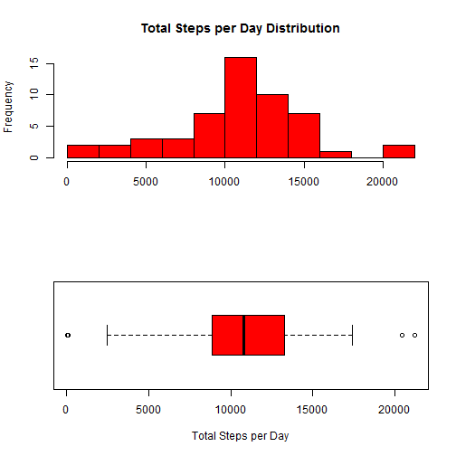
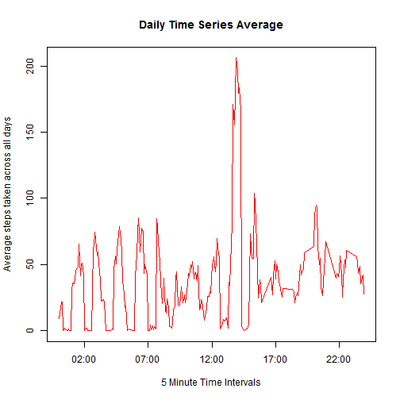
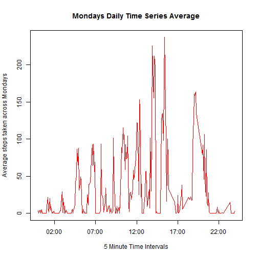
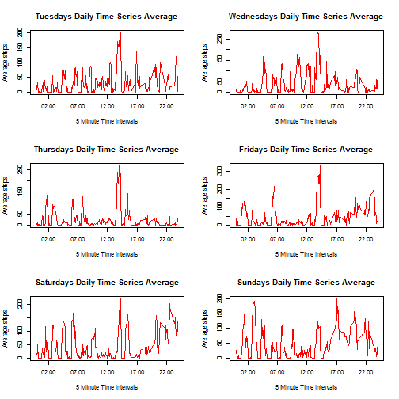
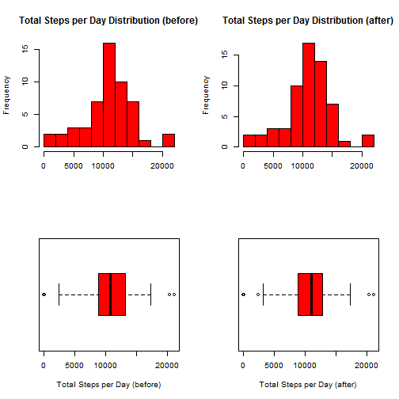
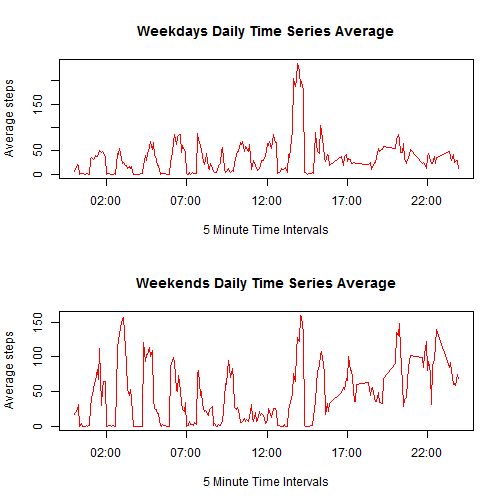

---
output:
  html_document:
    keep_md: yes
---
# Reproducible Research: Peer Assessment 1

It is now possible to collect a large amount of data about personal movement using activity monitoring devices such as a Fitbit, Nike Fuelband, or Jawbone Up. These type of devices are part of the "quantified self" movement - a group of enthusiasts who take measurements about themselves regularly to improve their health, to find patterns in their behavior, or because they are tech geeks. But these data remain under-utilized both because the raw data are hard to obtain and there is a lack of statistical methods and software for processing and interpreting the data.

This report makes use of data from a personal activity monitoring device. This device collects data at 5 minute intervals through out the day. The data consists of two months of data from an anonymous individual collected during the months of October and November, 2012 and include the number of steps taken in 5 minute intervals each day.

The data for this report is included in zip format in the [project github repository][1] and can also be downloaded directly from the [course web site][2].

The variables included in this dataset are:

* steps: Number of steps taking in a 5-minute interval (missing values are coded as NA)

* date: The date on which the measurement was taken in YYYY-MM-DD format

* interval: Identifier for the 5-minute interval in which measurement was taken

The dataset is stored in a comma-separated-value (CSV) file and there are a total of 17,568 observations in this dataset.

## Loading and preprocessing the data

Using read.csv the raw data is loaded into R for analysis.

```r
rawdata <- read.csv("activity.csv")
lapply(rawdata, class)
```

```
## $steps
## [1] "integer"
## 
## $date
## [1] "factor"
## 
## $interval
## [1] "integer"
```

```r
rawdata$interval <- as.factor( format( as.POSIXct('0001-01-01 00:00:00') + rawdata$interval*60,
                                       "%H:%M:%S") )
head(rawdata)
```

```
##   steps       date interval
## 1    NA 2012-10-01 00:00:00
## 2    NA 2012-10-01 00:05:00
## 3    NA 2012-10-01 00:10:00
## 4    NA 2012-10-01 00:15:00
## 5    NA 2012-10-01 00:20:00
## 6    NA 2012-10-01 00:25:00
```
In order to explore and understand the data set, valid values per day are checked

```r
tapply(!is.na(rawdata$steps),rawdata$date,sum)
```

```
## 2012-10-01 2012-10-02 2012-10-03 2012-10-04 2012-10-05 2012-10-06 
##          0        288        288        288        288        288 
## 2012-10-07 2012-10-08 2012-10-09 2012-10-10 2012-10-11 2012-10-12 
##        288          0        288        288        288        288 
## 2012-10-13 2012-10-14 2012-10-15 2012-10-16 2012-10-17 2012-10-18 
##        288        288        288        288        288        288 
## 2012-10-19 2012-10-20 2012-10-21 2012-10-22 2012-10-23 2012-10-24 
##        288        288        288        288        288        288 
## 2012-10-25 2012-10-26 2012-10-27 2012-10-28 2012-10-29 2012-10-30 
##        288        288        288        288        288        288 
## 2012-10-31 2012-11-01 2012-11-02 2012-11-03 2012-11-04 2012-11-05 
##        288          0        288        288          0        288 
## 2012-11-06 2012-11-07 2012-11-08 2012-11-09 2012-11-10 2012-11-11 
##        288        288        288          0          0        288 
## 2012-11-12 2012-11-13 2012-11-14 2012-11-15 2012-11-16 2012-11-17 
##        288        288          0        288        288        288 
## 2012-11-18 2012-11-19 2012-11-20 2012-11-21 2012-11-22 2012-11-23 
##        288        288        288        288        288        288 
## 2012-11-24 2012-11-25 2012-11-26 2012-11-27 2012-11-28 2012-11-29 
##        288        288        288        288        288        288 
## 2012-11-30 
##          0
```
Full day of data are missing from the data set. This behaviour is assumed to be true going forward.

## What is the mean of the total number of steps taken per day?
For this part of the assignment, missing values in the dataset are ignored.

```r
totalStepsPerDay <- tapply(rawdata$steps,rawdata$date,sum)
totalStepsPerDay <- totalStepsPerDay[!is.na(totalStepsPerDay)]
```

### 1. Make a histogram of the total number of steps taken each day

```r
par(mfrow = c(2, 1))

hist(   totalStepsPerDay, 
        col = "red",
        main = "Total Steps per Day Distribution",
        xlab = "",
        breaks=10) 

boxplot(   totalStepsPerDay, 
           col = "red",
           xlab = "Total Steps per Day",
           horizontal=TRUE)
```

 

### 2. Calculate and report the mean and median total number of steps taken per day

```r
totalStepsPerDayMean <- mean(totalStepsPerDay)
totalStepsPerDayMedian <- median(totalStepsPerDay)
```

Ignoring the missing values, the **mean** for the total number of the steps per day is **10766.19** and the **median** is **10765**.

## What is the average daily activity pattern?
For this part of the assignment, missing values in the dataset continue to be ignored.

```r
timeIntervals <- strptime( as.character(levels(rawdata$interval)), "%H:%M:%S")
averageStepsPerInterval <- tapply( rawdata$steps[!is.na(rawdata$steps)],
                                   rawdata$interval[!is.na(rawdata$steps)],
                                   mean )
```

### 1. Make a time series plot (i.e. type = "l") of the 5-minute interval (x-axis) and the average number of steps taken, averaged across all days (y-axis)

```r
plot(   timeIntervals,
        averageStepsPerInterval,
        type = "l",
        col  = "red",
        main = "Daily Time Series Average",
        xlab = "5 Minute Time Intervals",
        ylab = "Average steps taken across all days" ) 
```

 

### 2. Which 5-minute interval, on average across all the days in the dataset, contains the maximum number of steps?

```r
maxidx <- which.max(averageStepsPerInterval)
maxInterval <- paste( "[", 
                      names(averageStepsPerInterval[maxidx]), 
                      "-", 
                      names(averageStepsPerInterval[maxidx+1])
                      , ")" )
```
Ignoring the missing values, the **interval [ 13:55:00 - 14:00:00 )** contains the **maximum** number of steps in average across all the days.

## Imputing missing values

Note that there are a number of days/intervals where there are missing values (coded as NA). The presence of missing days may introduce bias into some calculations or summaries of the data.

### 1. Calculate and report the total number of missing values in the dataset (i.e. the total number of rows with NAs)

The total number of rows with NA is: **2304**

### 2. Devise a strategy for filling in all of the missing values in the dataset. The strategy does not need to be sophisticated. For example, you could use the mean/median for that day, or the mean for that 5-minute interval, etc.

Assuming a weekly pattern, missing values will be filled with the mean for that 5-minute interval for the day of the week.


```r
dayofweeks <- c("Sunday", "Monday", "Tuesday", "Wednesday", "Thursday", "Friday", "Saturday")[as.POSIXlt(rawdata$date)$wday + 1]

averageStepsPerIntervalperDoW <- data.frame ( 
    Monday = tapply( rawdata$steps[!is.na(rawdata$steps) & dayofweeks == "Monday"],
                     rawdata$interval[!is.na(rawdata$steps) & dayofweeks == "Monday"],
                     mean ),
    Tuesday = tapply( rawdata$steps[!is.na(rawdata$steps) & dayofweeks == "Tuesday"],
                     rawdata$interval[!is.na(rawdata$steps) & dayofweeks == "Tuesday"],
                     mean ),
    Wednesday = tapply( rawdata$steps[!is.na(rawdata$steps) & dayofweeks == "Wednesday"],
                     rawdata$interval[!is.na(rawdata$steps) & dayofweeks == "Wednesday"],
                     mean ),
    Thursday = tapply( rawdata$steps[!is.na(rawdata$steps) & dayofweeks == "Thursday"],
                     rawdata$interval[!is.na(rawdata$steps) & dayofweeks == "Thursday"],
                     mean ),
    Friday = tapply( rawdata$steps[!is.na(rawdata$steps) & dayofweeks == "Friday"],
                     rawdata$interval[!is.na(rawdata$steps) & dayofweeks == "Friday"],
                     mean ),
    Saturday = tapply( rawdata$steps[!is.na(rawdata$steps) & dayofweeks == "Saturday"],
                     rawdata$interval[!is.na(rawdata$steps) & dayofweeks == "Saturday"],
                     mean ),
    Sunday = tapply( rawdata$steps[!is.na(rawdata$steps) & dayofweeks == "Sunday"],
                     rawdata$interval[!is.na(rawdata$steps) & dayofweeks == "Sunday"],
                     mean ) )
```

With this strategy we will use the following estimations:
 
 


### 3. Create a new dataset that is equal to the original dataset but with the missing data filled in.

```r
cleandata <- rawdata

for ( i in 1:nrow(cleandata) ) {
    if( is.na(cleandata$steps[i]) ) {
        cleandata$steps[i] <- averageStepsPerIntervalperDoW[cleandata$interval[i],dayofweeks[i]]
    }
} 
```


### 4. Make a histogram of the total number of steps taken each day and Calculate and report the mean and median total number of steps taken per day. Do these values differ from the estimates from the first part of the assignment? What is the impact of imputing missing data on the estimates of the total daily number of steps?

```r
cleanTotalStepsPerDay <- tapply(cleandata$steps,cleandata$date,sum)
```

 

### 2. Calculate and report the mean and median total number of steps taken per day


By filling the missing values, the **mean** for the total number of the steps per day is **10821.21** (before 10766.19) and the **median** is **11015.00** (before 10765).

Both from the histograms and the mean/median calculation, minor distribution changes are appreciated.

## Are there differences in activity patterns between weekdays and weekends?

The dataset with the filled-in missing values will be used in this section.

### Create a new factor variable in the dataset with two levels – “weekday” and “weekend” indicating whether a given date is a weekday or weekend day.


```r
typeOfDays <- c("Weekend", "Weekday", "Weekday", "Weekday", "Weekday", "Weekday", "Weekend")[as.POSIXlt(cleandata$date)$wday + 1]

averageStepsPerIntervalperToD <- data.frame ( 
    Weekday = tapply( cleandata$steps[typeOfDays == "Weekday"],
                      cleandata$interval[ typeOfDays == "Weekday"],
                     mean ),
    Weekend = tapply( cleandata$steps[ typeOfDays == "Weekend"],
                      cleandata$interval[ typeOfDays == "Weekend"],
                      mean ) )
```


### Make a panel plot containing a time series plot (i.e. type = "l") of the 5-minute interval (x-axis) and the average number of steps taken, averaged across all weekday days or weekend days (y-axis). 

```r
par(mfrow = c(2, 1))
plot(   timeIntervals,
        averageStepsPerIntervalperToD$Weekday,
        type = "l",
        col  = "red",
        main = "Weekdays Daily Time Series Average",
        xlab = "5 Minute Time Intervals",
        ylab = "Average steps" ) 
plot(   timeIntervals,
        averageStepsPerIntervalperToD$Weekend,
        type = "l",
        col  = "red",
        main = "Weekends Daily Time Series Average",
        xlab = "5 Minute Time Intervals",
        ylab = "Average steps" ) 
```

 


[1]: https://github.com/pajarom/RepData_PeerAssessment1 "Project Github Repository" 
[2]: https://d396qusza40orc.cloudfront.net/repdata%2Fdata%2Factivity.zip "Course Web Site"
